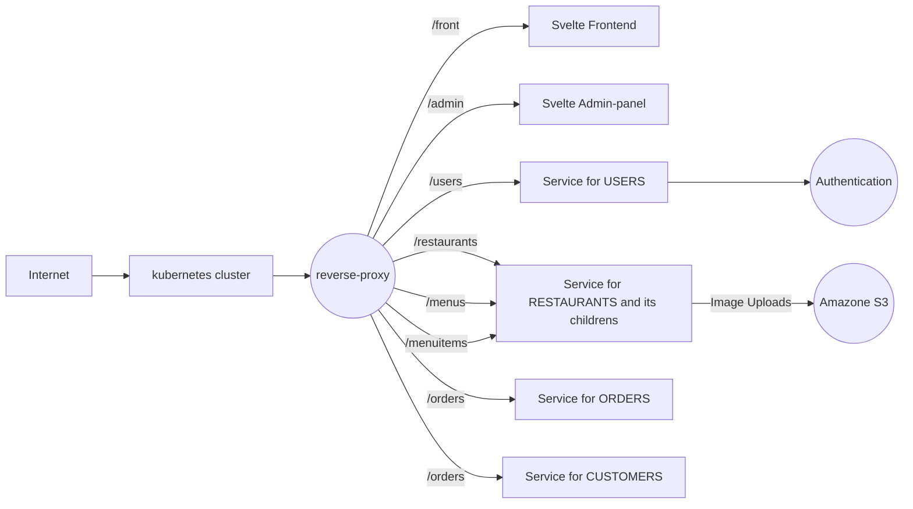

# Micro Restaurants

Micro Restaurants is a multi-restaurant management system developed using the **Microservice Skeleton** which uses the
1. Typescript - for development.
2. Sequelize JS - for database and modeling
3. Hapi/Joi - for requests validation and model verification
4. Axios - for inter-communications and object requests
5. ExpressJs - for handling the http-calls, routing and controlling. 

the frontend is developed using svelte framework. 

# Architecture is divided into 6 microservices. 
1. Frontend - Admin panel for the multi-restaurant management. [SVELTE]
2. Restaurant Front - Ordering and Restaurant listings for the customers [SVELTE]
3. Customers API - for handling all the customers calls. 
4. Orders API - for handling all the Orders and Orderitems calls. 
5. Restaurants API - for handling all the Restaurants, Menus and MenuItems calls. 
6. Users API - for handling all the Users and Authentication calls. 

# Restaurant Reverse Proxy
All the requests are called upon the restaurant-reverse-proxy which handles all the routing between the microservices. it can be found on `./deployment/docker/`. I have used Nginx as a reverse proxy and the configuration can be found on `./deployment/docker/nginx.conf`

# Frontend 
for serving the static content I have used Nginx http server. both of the svelte parts are build and then packaged into the docker container. so before running the `docker_build` command you must run the `npm run build` in both of the svelte apps. so it would generate the distributable for the docker. 

# Docker Images

https://hub.docker.com/repository/docker/adamhingoro/restaurant-reverseproxy
https://hub.docker.com/repository/docker/adamhingoro/microservice-restaurant-front
https://hub.docker.com/repository/docker/adamhingoro/microservicefrontend
https://hub.docker.com/repository/docker/adamhingoro/restaurant-microservice-users-api
https://hub.docker.com/repository/docker/adamhingoro/restaurant-microservice-restaurants-api
https://hub.docker.com/repository/docker/adamhingoro/restaurant-microservice-orders-api
https://hub.docker.com/repository/docker/adamhingoro/restaurant-microservice-customers-api

# Setup 
1. run `npm install && npm run build` in `./microservice-frontend` & `./microservice-restaurant-front`

2. configure the envoriment variables for docker in `./deployment/docker/docker-compose-build.yaml`
    you can set different database for each service or you can use one database for all of the services. 
    make sure to use same `JWT_SECRET` because the user token will be verified on all of the services. 
    
3. run the files `docker_build` and then `docker_run`

for deployment on kubernetes 

use the directory `./deployment/k8s/`

before loading any files to the kubernetes make sure to configure the envoriment variables in `env-secret.yaml` and `env-configmap.yaml`

# Runnig the Application
once you deploy the application you can access the frontend : http://[your-reverse-proxy-address]:8100/admin/ for admin and http://[your-reverse-proxy-address]:8100/front/ for ordering and viewing the menu. 

# Default Admin credentails
email `adam@gmail.com`
password `computer`

# UML Diagram 

# Thank You
